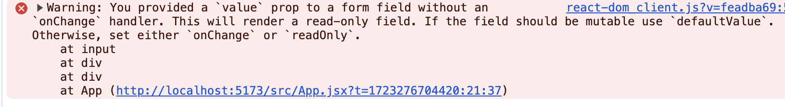

### input 태그 value 프로퍼티에 useState와 함께 사용하려면 onChange()가 필요



### 컴포넌트 분리

1. 별도 jsx 파일을 생성
2. 컴포넌트에 알맞게 작성
3. 컴포넌트를 export
  - `export default TodoHeader;`
4. App.jsx 혹은 상위 컴포넌트에서 조합
  - `<TodoHeader />`
  - `import TodoHeader from './components/TodoHeader';`

### 아마 앞으로 마주할 예상(?)되는 문제들
- 컴포넌트를 분리했을때 상태관리를 제대로 안되는 문제?
  - 컴포넌트를 분리(커밋:ac71438)한 상태에서 다음의 에러가 발생하는데 해당 컴포넌트 상태를 가지지 않았기 때문
  - `TodoInput.jsx:17 Uncaught ReferenceError: setTodos is not defined`
    - 이때 주의할 점은 컴포넌트마다 상태를 고유값으로 갖기 때문에 TodoInput과 TodoList에 상태를 가진다고 해서 문제가 해결되지 않음 -> 상태를 공유하는 개념이 있나??
    - 상위 컴포넌트에서 하위 컴포넌트에게 상태를 공유하는 개념이 존재 -> 이게 프롭스(Props)임
    - 상위 컴포넌트(App.jsx)가 하위 컴포넌트(TodoInput, TodoList)에게 상태를 전파(?)해서 콜백을 통해 상위 컴포넌트의 상태를 변경해주는 개념으로 이해함

AS-IS
```javascript
// TodoList.jsx - 상태를 가짐
const [todos, setTodos] = useState(fetchTodos());

// TodoInput.jsx - 에러 발생
ReferenceError: setTodos is not defined

문제: 상태를 공유하지 않음
```

TO-BE - 1
```javascript
// App.jsx - 상위 컴포넌트
import { useState } from 'react'
...
function App() {

  const [todos, setTodos] = useState(fetchTodos());

  return (
    <div>
      <TodoHeader />
      <TodoInput />
      <TodoList todos={todos} />
    </div>
  )
}

// TodoList.jsx(하위 컴포넌트) - 상위 컴포넌트에서 전달한 props를 받도록 설정
function TodoList({ todos }) {...}

문제: 상태 변경 메서드(setTodos)를 상위로 올려주지 않음. 따라서 여전히 다음의 에러가 발생
-> TodoList.jsx:7 Uncaught ReferenceError: setTodos is not defined
```

TO-BE - 2
```javascript
[TO-BE - 1]에서 해결되지 않은 문제에서 setTodos를 호출하는 function을 상위 컴포넌트로 옮기고 하위 컴포넌트에게 props로 내려주어야 정상적으로 동작함

// App.jsx - 상위 컴포넌트
function App() {

  const [todos, setTodos] = useState(fetchTodos());

  const handleRemove = (todo, index) => {
    console.log('remove 버튼 클릭', todo, index);
    const result = todos.filter((item) => item !== todo);

    setTodos(result);
    localStorage.removeItem(todo);
  }

  return (
    <div>
      <TodoHeader />
      <TodoInput />
      <TodoList todos={todos} onTodoRemove={handleRemove} />
    </div>
  )
}

// TodoList.jsx(하위 컴포넌트) - 상위 컴포넌트에서 전달한 props를 받도록 설정
function TodoList({ todos, onTodoRemove }) {

  return (
    <div>
      <ul>
        {todos.map((todo, index) => {
          return (
            <li key={index}>
              <span>{todo}</span> 
              <button onClick={() => onTodoRemove(todo, index)}>remove</button>
            </li>
          )
        })}
      </ul>
    </div>
  )
}
```
> 이게 번거로울수는 있지만 이렇게 다루게 되면 하위 컴포넌트는 상위 컴포넌트로부터 데이터를 받아와서 화면을 보여지는 부분만 담당하면 되고, 상위 컴포넌트는 조금 더 데이터에 가까운 방식으로 구현이 될 수가 있을듯
> 다만 이게 너무 과하면.. 투머치가 될듯...?


- export, import
